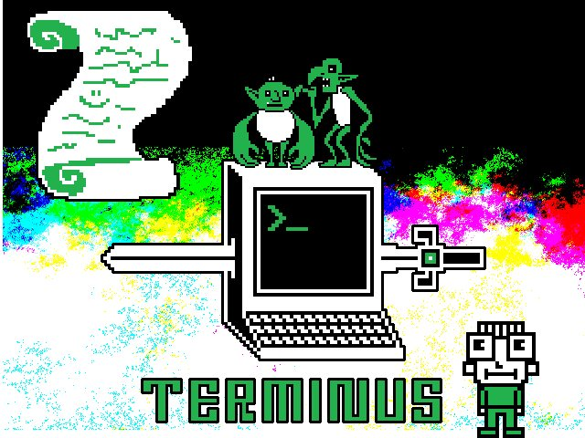

In a mysterious land, both physical and magical powers had been surpassed by a new power.
The land is very peaceful, but great powers involve great struggles.
Awakened in a strangely familiar place, you discover that you could use this power without knowing how.
Now, you want to learn how to use it.

Terminus is a text adventure game running on your Web browser.

The aim is not to destroy the enemy, no, you'll just have to help people you could meet.

Parenthèse
==========
(fr)

# LE JEU EST EN COURS DE DÉVELOPPEMENT

Actuellement, les modifications scénaristiques et de fonctionnalités se font arbritrairement par un seule personne.
Moi. Cela fait depuis juillet 2017 que je travaille de manière plus ou moins assidue sur ce projet.
Par conséquent : s'il vous plaît, ne soyez pas trop enthousiastes.
Ce projet a besoin de temps pour murir. Je ne suis pas scénariste, je ne suis pas graphiste.
Ce projet a donc aussi besoin de ressources.

# Quels sont les limites pour proposer ses idées ?
La licence n'interdit pas de forker le projet, et encourage même a participer en proposant des pull-requests.

Les limites suivantes expriment des raisons valables pour refuser une pull-request sans autre explication.

* Le jeu doit être utilisable par une personne utilisant un lecteur d'écran; les minijeux et les énigmes, ne peuvent donc pas s'appuyer sur des éléments visuels, ou, au cas échéant, proposer une alternative à leur résolution;
* Tout sujet en défaveur de l'égalité  des droits et des chances entre êtres humains quelque soit leur sexe, ou autres critères physiques; des mouvements pour les droits des animaux, des mouvements LGBTQ, du logiciel libre... c'est-à-dire tout point de scénario à raisonnement raciste, sexiste, genriste, validiste, spéciste sera écarté de ce projet;
* Il en est de même pour tout scénario incitant à des actes de violences envers des êtres vivants.

Dans la même logique, si une pull-request non destructrice[1](#myfootnote1) permet de résoudre une incompatibilité entre les points cités et l'état actuel du jeu, alors cette dernière sera acceptée (même en présence de fautes d'orthographes ou bugs mineurs[2](#myfootnote2)).

<a name="myfootnote1">1</a>: non destructrice = qui ne détruit ou modifie aucune autre partie que celle qui concerne le sujet

<a name="myfootnote1">2</a>: les bugs et fautes d'orthographes seront alors traités en priorité sur les autres sujets

# Faire partie de l'équipe

Le jeu sera certainement plus aboutit si de nouvelles personnes sont incluses dans le processus créatif.
Toute proposition est bonne à prendre et à discuter.
Cependant, aucune décision ne peut être prise à la légère.

Si vous comprenez bien cela, je vous invite à venir discuter sur via Framateam  https://framateam.org/terminusjeu
.

(en)

# Join the team
Sorry, the english part of this project is completely destroyed.
Anyway, if you wish to collaborate on this project,
take a look at the Framateam page https://framateam.org/terminusjeu

Just declare your presence to invite people to speak english.

About the project
=================
This project is deviant fork of [mprat's Terminus project](http://mprat.github.io/Terminus/).

Use the game (testing)
======================
Open '''index.html''' in '''src'''.

If you need to change lang,
modify the line containing 'terminus.dialog.lang.js'.

Generate missing files
======================
You need to install NodeJs before.

Do '''make''' in the directory containing Makefile.

This will install dependencies and assemble files.

Update translations
===================
Edit '''.po''' file in '''src/js''' and generate missing files.

The translation "terminal.dialog.lang.js" in "src/js" will be updated.

Get minified versions
=====================
Generate missing files.

The minified will appear in '''webroot'''.

Educational targets
===================
The game aims to

- encourage curiosity
- initiate to terminal / command line
+ be usable for game hacking / creation (aim of the fork)

Why the terminal ?
==================
Our usage of computers are focused on graphical user interfaces,
but most of the advanced settings of a system are only accessible with the console mode.
This is done :

- because this is simplest solution, especially for the server machines
- because it asks less resources to the computer
- because many powerful tools are only usable on command line interface, in order to be used in scripts
- to avoid to fear users about things they don't know how to use

By not knowing the command line and scripting.
The user is limited by usage, and is jailed in waiting that some software will do something approaching to the needs.
Therefore the command line tools are very well documented without asking on the Web.

By learning how work command line, you'll be able to do things on your computer, and on a server, such as :

- installing non-packaged applications
- finding files or a specific informations without installing a new software
- calling scripts and programs with advanced options
- accessing servers
- develop simple scripts for launching a set of applications with one click

Deviant part
============
If you tested the orginal Terminus game, you may discover that :

- the scenario had been altered
- the MIT part and the 'add' locker command had been removed, because these things are really specific to MIT
- there is sounds
- UI has changed in order to be usable with click only
- UI cheats on the accessibility...
